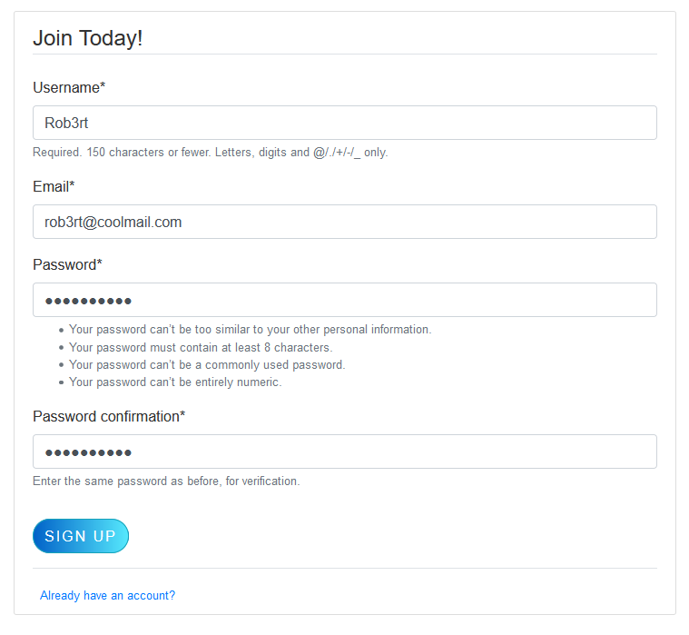
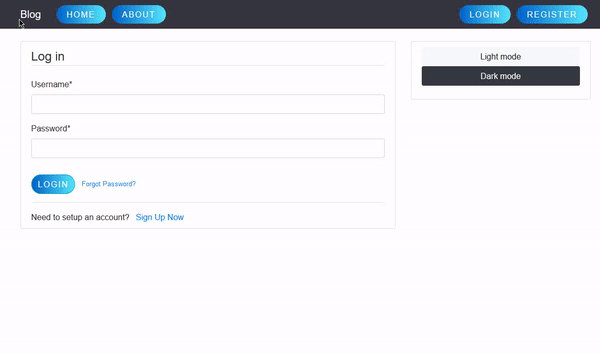
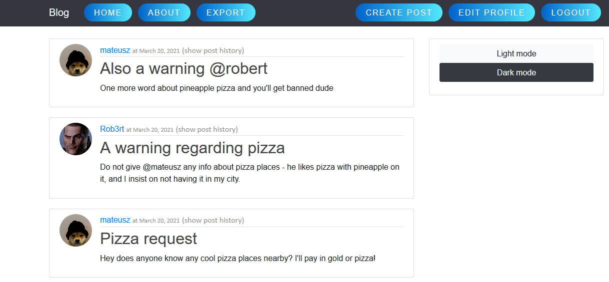
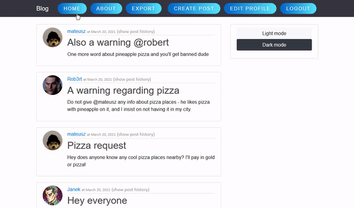
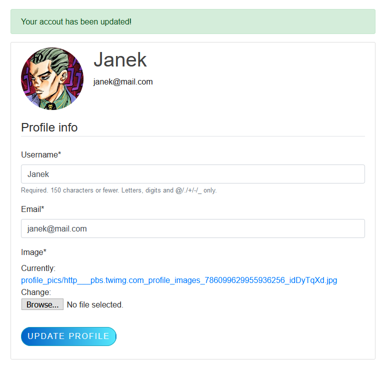

# Django Blog

Blog web application powered by Django, created in group as a final project for Web Technologies course on University of Economics in Katowice.

To install required dependencies navigate to project's directory and run:

```cmd
pip install -r requirements.txt
```

To start up the server run:

```cmd
python manage.py runserver
```

# Functionality

- ##### User-side:
    - Creating account
    - Logging in/logging out
    - Resetting password if forgot (via mail)
    - Adding posts
    - Editing posts
    - Deleting posts
    - Adding/changing personal information on profile
    - Adding/changing profile photo
    
- ##### Admin-side:
    - All of above
    - Admin panel (allows managing database)
    - Export database to:
        - JSON
        - CSV
    
# Screenshots/GIFS

### Creating account
<div style="text-align:center">
    
</div>

### Logging in
<div style="text-align:center">
    
</div>

### Main feed
<div style="text-align:center">
    
</div>

### Dark mode
<div style="text-align:center">
    
</div>

### Updated user profile
<div style="text-align:center">
    
</div>

### Creating and updating a post
<div style="text-align:center">
    
</div>

# Knows issues

- Sometimes CSS won't load and app will look all messed up. To fix it, delete browser cache or open blog in a new, private session/tab.